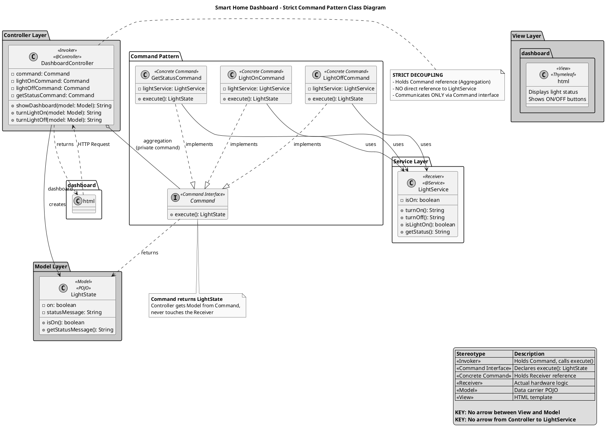
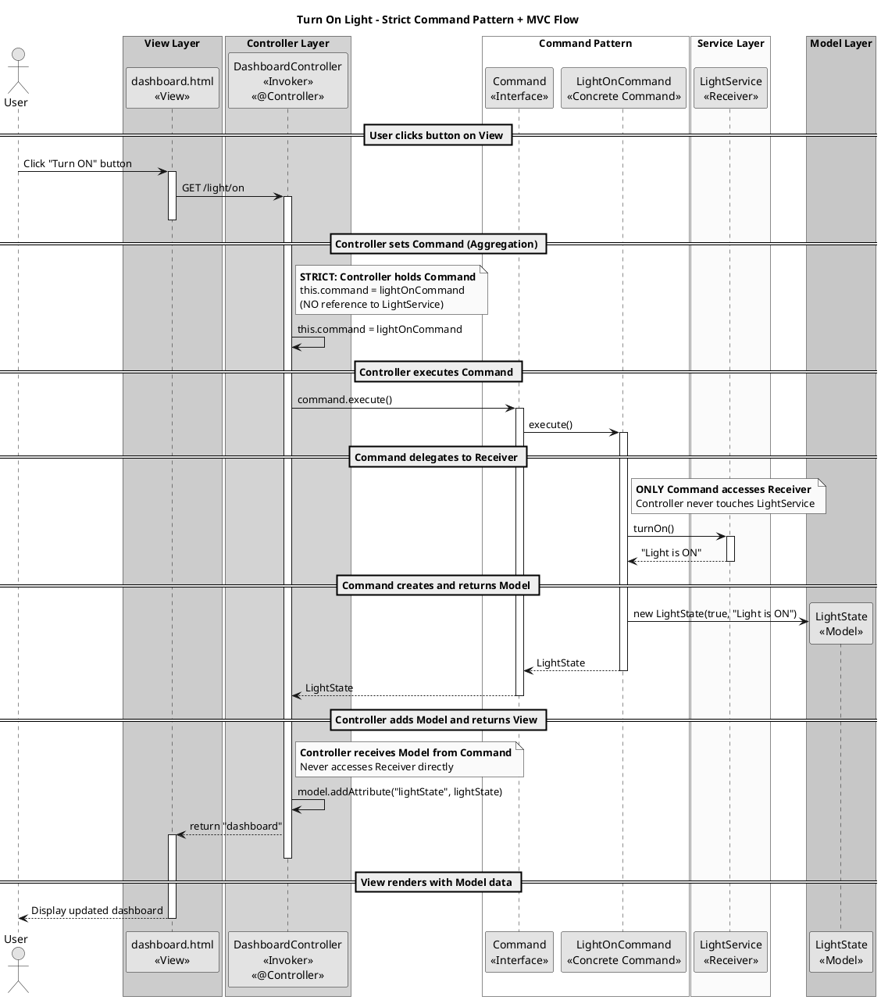

# Smart Home Automation - Strict Command Design Pattern with MVC

## 1. Conceptual Mapping

### Architecture Overview

This implementation demonstrates a **Strict Command Design Pattern** integrated with **Model-View-Controller (MVC)** architecture.

### Key Constraints (Strict Command Pattern)

1. **Invoker-Command Aggregation**: The Controller (Invoker) holds a `private Command command;` reference.
2. **Strict Decoupling**: The Controller has **NO direct reference** to the Receiver (LightService). It communicates **ONLY via the Command interface**.
3. **Clean Diagram**: No direct relationship between View and Model class - Controller handles all data flow.

### MVC Components

| MVC Layer | Implementation | Description |
|-----------|----------------|-------------|
| **View** | `dashboard.html` | Thymeleaf template that displays the Smart Home Dashboard. |
| **Controller** | `DashboardController` | Invoker - holds Command reference, executes commands, returns View name. |
| **Model** | `LightState` | POJO that carries data from Controller to View. |

### Command Pattern Participants

| Pattern Role | Implementation | Description |
|--------------|----------------|-------------|
| **Invoker** | `DashboardController` | Holds `private Command command;` and calls `execute()`. Has NO reference to Receiver. |
| **Command Interface** | `Command` | Declares `execute()` method returning `LightState`. |
| **Concrete Commands** | `LightOnCommand`, `LightOffCommand`, `GetStatusCommand` | Hold reference to Receiver, encapsulate actions. |
| **Receiver** | `LightService` | Contains actual hardware logic. Only Commands access it. |

### Strict Decoupling Flow

```
Controller (Invoker) → Command Interface → Concrete Command → LightService (Receiver)
                              ↓
                         LightState (Model)
                              ↓
                        View (dashboard.html)
```

**Note**: Controller NEVER accesses LightService directly - only through Commands.

---

## 2. PlantUML Class Diagram (Strict Compliance)



---

## 3. PlantUML Sequence Diagram (Strict MVC Cycle)



---

## 4. Java Spring Boot Implementation

### File Structure
```
src/main/java/com/smarthome/
├── SmartHomeApplication.java
├── command/
│   ├── Command.java               # Interface: execute() returns LightState
│   ├── LightOnCommand.java        # Concrete: holds LightService
│   ├── LightOffCommand.java       # Concrete: holds LightService
│   └── GetStatusCommand.java      # Concrete: holds LightService
├── controller/
│   └── DashboardController.java   # Invoker: holds Command, NO LightService reference
├── model/
│   └── LightState.java            # POJO: carries data to View
└── service/
    └── LightService.java          # Receiver: actual hardware logic

src/main/resources/templates/
└── dashboard.html                 # View: displays data
```

### Key Implementation Details

**DashboardController (Invoker):**
```java
@Controller
public class DashboardController {
    // STRICT: Holds Command reference (Aggregation)
    private Command command;
    
    // Pre-configured commands
    private final Command lightOnCommand;
    private final Command lightOffCommand;
    private final Command getStatusCommand;
    
    // NO direct reference to LightService in methods!
    
    @GetMapping("/light/on")
    public String turnLightOn(Model model) {
        this.command = lightOnCommand;        // Set command
        LightState lightState = command.execute();  // Execute
        model.addAttribute("lightState", lightState);
        return "dashboard";
    }
}
```

**Command Interface:**
```java
public interface Command {
    LightState execute();  // Returns Model, not String
}
```

**Concrete Command:**
```java
public class LightOnCommand implements Command {
    private final LightService lightService;  // Only Commands hold Receiver
    
    @Override
    public LightState execute() {
        String result = lightService.turnOn();
        return new LightState(lightService.isLightOn(), result);
    }
}
```

---

## Summary - Strict Compliance

| Requirement | Implementation |
|-------------|----------------|
| **Invoker-Command Aggregation** | `DashboardController` has `private Command command;` field |
| **Strict Decoupling** | Controller has NO reference to `LightService` - only Commands do |
| **No View-Model direct arrow** | Controller handles all data flow between View and Model |
| **Command returns Model** | `execute()` returns `LightState`, not `String` |

This architecture ensures the Controller (Invoker) is completely decoupled from the Receiver (LightService) and communicates **ONLY through the Command interface**.
