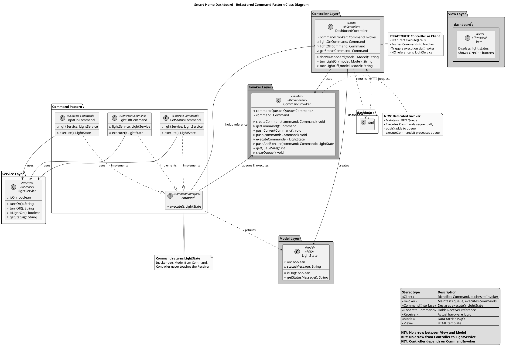
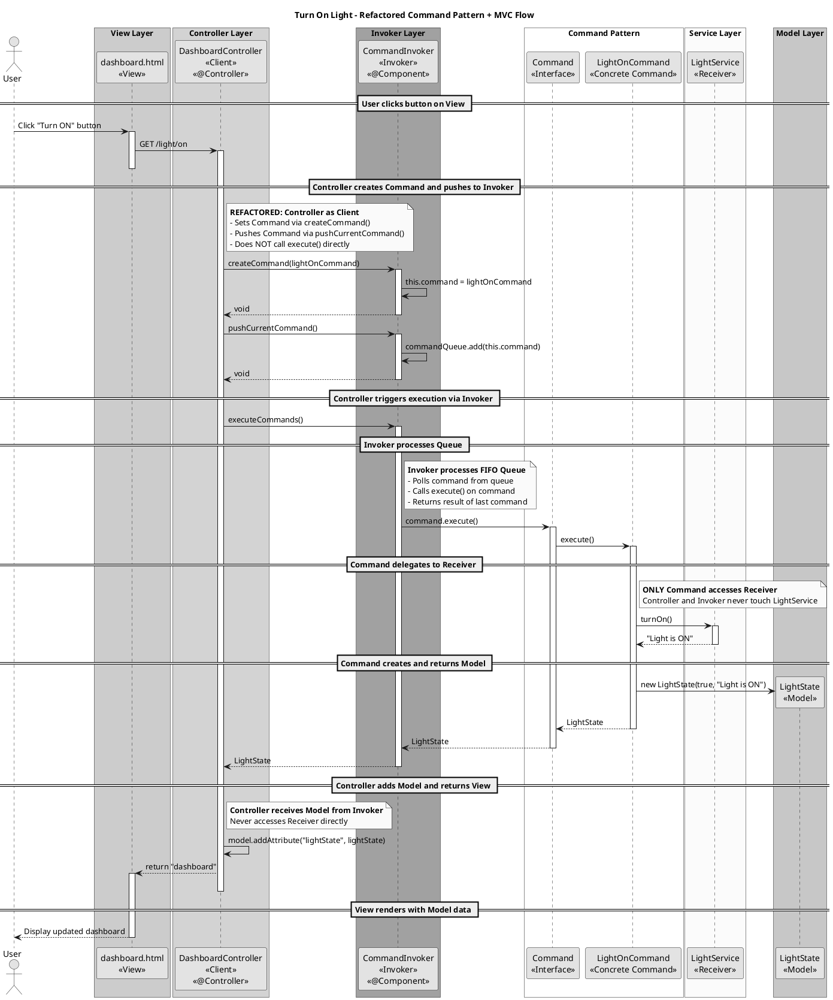

# Smart Home Automation - Strict Command Design Pattern with MVC

## 1. Conceptual Mapping

### Architecture Overview

This implementation demonstrates a **Strict Command Design Pattern** integrated with **Model-View-Controller (MVC)** architecture. The architecture has been refactored to achieve strict separation of concerns by extracting the Invoker logic into a dedicated `CommandInvoker` class.

### Key Constraints (Strict Command Pattern with Queued Invoker)

1. **Dedicated Invoker Class**: The `CommandInvoker` class acts as the sole Invoker, maintaining a FIFO queue of commands.
2. **Controller as Client**: The `DashboardController` acts as a Client, not an Invoker. It identifies commands and pushes them to the `CommandInvoker`.
3. **Strict Decoupling**: The Controller has **NO direct reference** to the Receiver (LightService). It communicates **ONLY via the CommandInvoker**.
4. **FIFO Queue**: Commands are executed sequentially in the order they are pushed.
5. **Clean Diagram**: No direct relationship between View and Model class - Controller handles all data flow.

### MVC Components

| MVC Layer | Implementation | Description |
|-----------|----------------|-------------|
| **View** | `dashboard.html` | Thymeleaf template that displays the Smart Home Dashboard. |
| **Controller** | `DashboardController` | Client - identifies Command beans, pushes to Invoker, triggers execution, returns View name. |
| **Model** | `LightState` | POJO that carries data from Controller to View. |

### Command Pattern Participants

| Pattern Role | Implementation | Description |
|--------------|----------------|-------------|
| **Invoker** | `CommandInvoker` | Dedicated class that maintains FIFO queue, executes commands sequentially. |
| **Client** | `DashboardController` | Identifies commands, pushes to Invoker, triggers execution. Has NO reference to Receiver. |
| **Command Interface** | `Command` | Declares `execute()` method returning `LightState`. |
| **Concrete Commands** | `LightOnCommand`, `LightOffCommand`, `GetStatusCommand` | Hold reference to Receiver, encapsulate actions. |
| **Receiver** | `LightService` | Contains actual hardware logic. Only Commands access it. |

### Refactored Execution Flow

```
Controller (Client) → Creates Command → Pushes Command to Invoker → Invoker processes Queue → Command.execute() → LightService (Receiver)
                                                                        ↓
                                                                   LightState (Model)
                                                                        ↓
                                                                  View (dashboard.html)
```

**Note**: Controller NEVER accesses LightService directly and NEVER calls execute() directly - only through the CommandInvoker.

---

## 2. PlantUML Class Diagram (Refactored with CommandInvoker)



---

## 3. PlantUML Sequence Diagram (Refactored with Queued Invoker)



---

## 4. Java Spring Boot Implementation

### File Structure
```
src/main/java/com/smarthome/
├── SmartHomeApplication.java
├── command/
│   ├── Command.java               # Interface: execute() returns LightState
│   ├── LightOnCommand.java        # Concrete: holds LightService
│   ├── LightOffCommand.java       # Concrete: holds LightService
│   └── GetStatusCommand.java      # Concrete: holds LightService
├── controller/
│   └── DashboardController.java   # Client: pushes to Invoker, NO LightService reference
├── invoker/
│   └── CommandInvoker.java        # NEW: Dedicated Invoker with FIFO queue
├── model/
│   └── LightState.java            # POJO: carries data to View
└── service/
    └── LightService.java          # Receiver: actual hardware logic

src/main/resources/templates/
└── dashboard.html                 # View: displays data
```

### Key Implementation Details

**CommandInvoker (New Dedicated Invoker):**
```java
@Component
public class CommandInvoker {
    // FIFO queue to hold pending commands
    private final Queue<Command> commandQueue;
    
    // Currently set command
    private Command command;

    public CommandInvoker() {
        this.commandQueue = new LinkedList<>();
    }

    // Create command before pushing
    public void createCommand(Command command) {
        this.command = command;
    }
    
    // Get currently set command
    public Command getCommand() {
        return this.command;
    }
    
    // Push the currently set command to queue
    public void pushCurrentCommand() {
        if (this.command == null) {
            throw new IllegalStateException("No command has been set. Call createCommand() first.");
        }
        commandQueue.add(this.command);
    }

    // Push command to queue (direct push)
    public void push(Command command) {
        if (command != null) {
            commandQueue.add(command);
        }
    }

    // Execute all pending commands sequentially
    public LightState executeCommands() {
        LightState lastState = null;
        while (!commandQueue.isEmpty()) {
            Command command = commandQueue.poll();
            lastState = command.execute();
        }
        return lastState;
    }
}
```

**DashboardController (Refactored as Client):**
```java
@Controller
public class DashboardController {
    // Controller now depends on CommandInvoker, not direct execution
    private final CommandInvoker commandInvoker;
    
    // Pre-configured commands
    private final Command lightOnCommand;
    private final Command lightOffCommand;
    private final Command getStatusCommand;
    
    // NO direct reference to LightService in methods!
    
    @GetMapping("/light/on")
    public String turnLightOn(Model model) {
        // Create the command first
        commandInvoker.createCommand(lightOnCommand);
        // Push to Invoker
        commandInvoker.pushCurrentCommand();
        // Trigger execution via Invoker
        LightState lightState = commandInvoker.executeCommands();
        model.addAttribute("lightState", lightState);
        return "dashboard";
    }
}
```

**Command Interface:**
```java
public interface Command {
    LightState execute();  // Returns Model, not String
}
```

**Concrete Command:**
```java
public class LightOnCommand implements Command {
    private final LightService lightService;  // Only Commands hold Receiver
    
    @Override
    public LightState execute() {
        String result = lightService.turnOn();
        return new LightState(lightService.isLightOn(), result);
    }
}
```

---

## Summary - Refactored Architecture

| Requirement | Implementation |
|-------------|----------------|
| **Dedicated Invoker Class** | `CommandInvoker` class with FIFO queue, createCommand/push/execute methods |
| **Create Command Before Push** | `createCommand()` allows setting which command before pushing via `pushCurrentCommand()` |
| **Controller as Client** | `DashboardController` creates command, pushes to Invoker, triggers execution, no direct execute() |
| **FIFO Queue** | `CommandInvoker` maintains `Queue<Command>` for sequential execution |
| **Strict Decoupling** | Controller has NO reference to `LightService` - only Commands do |
| **Execution Flow** | Controller → Invoker.createCommand() → Invoker.pushCurrentCommand() → Invoker.executeCommands() → Command.execute() → Service |
| **No View-Model direct arrow** | Controller handles all data flow between View and Model |
| **Command returns Model** | `execute()` returns `LightState`, not `String` |

This refactored architecture ensures:
1. The Controller (Client) is completely decoupled from the Receiver (LightService)
2. The Controller can create which command before pushing it to the queue
3. The Controller does NOT call execute() directly on commands
4. All command execution goes through the dedicated CommandInvoker
5. Commands can be queued and executed sequentially (FIFO)
6. Strict separation of concerns between Client, Invoker, Command, and Receiver
