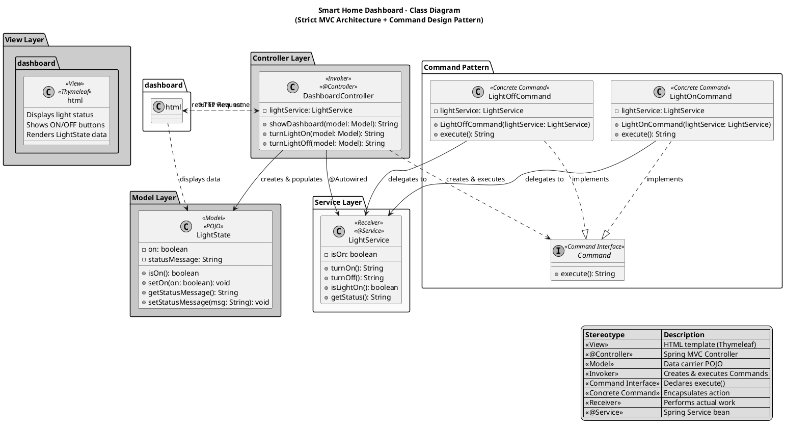
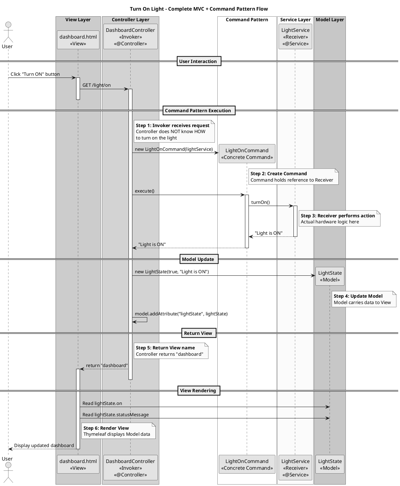

# Smart Home Automation - Command Design Pattern with Strict MVC

## 1. Conceptual Mapping

### Architecture Overview

This implementation demonstrates a **Strict Model-View-Controller (MVC)** architecture integrated with the **Command Design Pattern**.

### MVC Components

| MVC Layer | Implementation | Description |
|-----------|----------------|-------------|
| **View** | `dashboard.html` | Thymeleaf template that displays the Smart Home Dashboard. Shows light status and provides control buttons. |
| **Controller** | `DashboardController` | Receives requests, creates/executes Commands, updates Model, and returns View name. Uses `@Controller` annotation. |
| **Model** | `LightState` | Simple POJO that carries data (light status) from Controller to View. |

### Command Pattern Participants

| Pattern Role | Implementation | Description |
|--------------|----------------|-------------|
| **Invoker** | `DashboardController` | Creates Command objects and calls `execute()` without knowing implementation details. |
| **Receiver** | `LightService` | Contains the actual business/hardware logic for controlling the smart light bulb. |
| **Command Interface** | `Command` | Interface that declares the `execute()` method contract. |
| **Concrete Commands** | `LightOnCommand`, `LightOffCommand` | Encapsulate specific actions and delegate to the Receiver. |

### Complete MVC + Command Pattern Flow

```
User → View (dashboard.html) → Controller → Command → Service (Receiver) → Update Model → Return View → User
```

### Key Benefits

1. **MVC Separation**: View only knows about Model data, not about Services or Commands.
2. **Command Decoupling**: Controller doesn't know HOW to control the light, only Commands know.
3. **Single Responsibility**: Each layer has one job.
4. **Testability**: Each component can be tested independently.

---

## 2. PlantUML Class Diagram



---

## 3. PlantUML Sequence Diagram



---

## 4. Java Spring Boot Implementation

### File Structure
```
src/main/java/com/smarthome/
├── SmartHomeApplication.java      # Main application entry point
├── command/
│   ├── Command.java               # Command interface
│   ├── LightOnCommand.java        # Concrete command to turn ON
│   └── LightOffCommand.java       # Concrete command to turn OFF
├── controller/
│   ├── DashboardController.java   # MVC Controller (Invoker) - uses @Controller
│   └── SmartHomeController.java   # REST Controller (for API access)
├── model/
│   └── LightState.java            # Model POJO for View data
└── service/
    └── LightService.java          # Light service (Receiver)

src/main/resources/
└── templates/
    └── dashboard.html             # Thymeleaf View template
```

### How to Run

1. **Build the application:**
   ```bash
   mvn clean install
   ```

2. **Run the application:**
   ```bash
   mvn spring-boot:run
   ```

3. **Access the Dashboard:**
   - Open browser: `http://localhost:8080/dashboard`
   - Click "Turn ON" or "Turn OFF" buttons

4. **Alternative REST API:**
   - Turn ON: `curl http://localhost:8080/light/on`
   - Turn OFF: `curl http://localhost:8080/light/off`
   - Status: `curl http://localhost:8080/light/status`

---

## Summary

This implementation demonstrates a **Strict MVC Architecture** integrated with the **Command Design Pattern**:

| Layer | Component | Role |
|-------|-----------|------|
| **View** | `dashboard.html` | Displays UI, shows Model data |
| **Controller** | `DashboardController` | Receives requests, executes Commands, updates Model, returns View |
| **Model** | `LightState` | Data carrier POJO between Controller and View |
| **Command** | `Command`, `LightOnCommand`, `LightOffCommand` | Encapsulates actions, provides decoupling |
| **Service** | `LightService` | Receiver - performs actual hardware logic |

The complete flow is: **View → Controller → Command → Service → Update Model → Return View**

This architecture provides:
- **Clear separation** between UI (View), logic (Controller/Command), and data (Model)
- **Decoupling** via Command Pattern - Controller doesn't know HOW to control the light
- **Testability** - each component can be tested independently
- **Maintainability** - changes in one layer don't affect others
