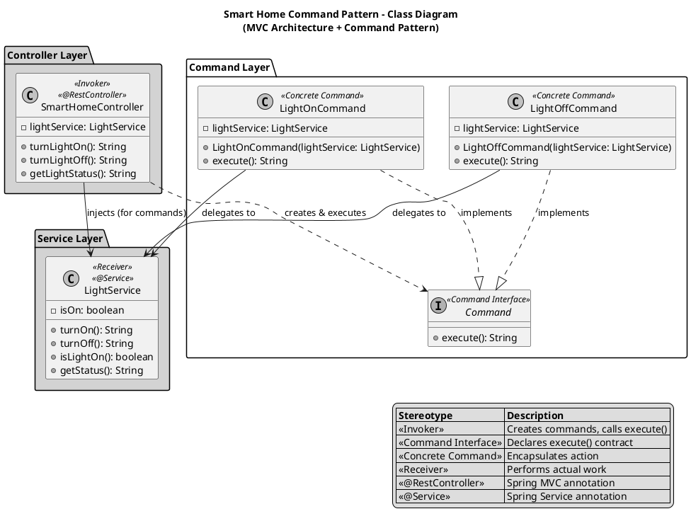
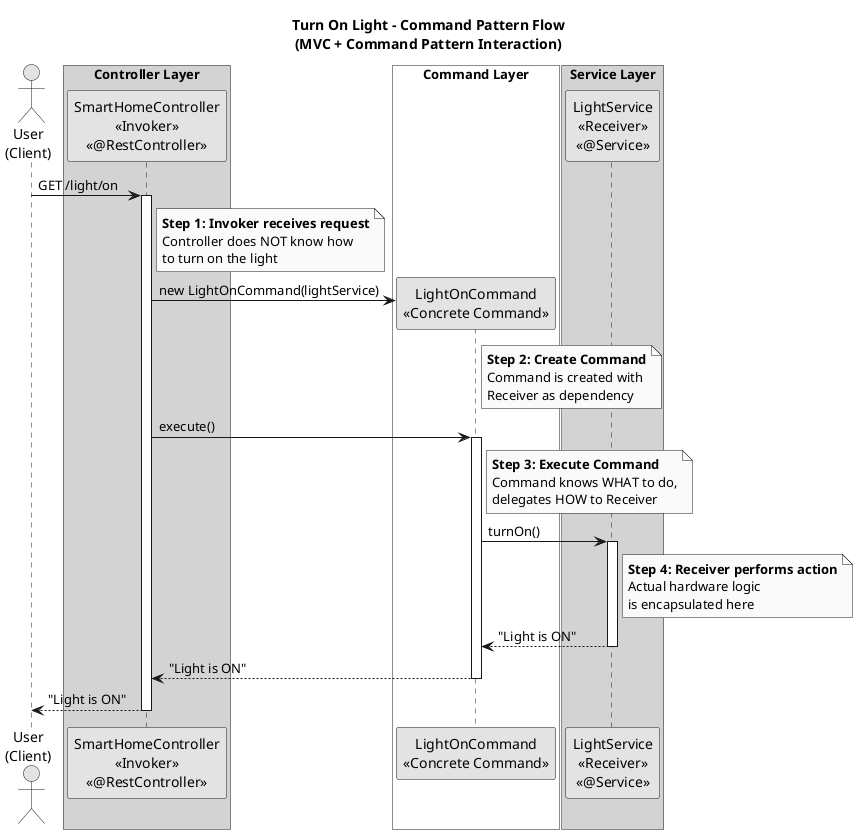

# Smart Home Automation - Command Design Pattern

## 1. Conceptual Mapping

### Pattern Participants

| Pattern Role | Implementation | Description |
|--------------|----------------|-------------|
| **Invoker** | `SmartHomeController` | The REST controller that receives HTTP requests from the user's web dashboard. It creates Command objects and calls `execute()` without knowing the implementation details. |
| **Receiver** | `LightService` | The service that contains the actual business/hardware logic for controlling the smart light bulb (turnOn, turnOff operations). |
| **Command Interface** | `Command` | The interface that declares the `execute()` method. All concrete commands must implement this interface. |
| **Concrete Commands** | `LightOnCommand`, `LightOffCommand` | Classes that implement the Command interface and encapsulate specific actions. Each command holds a reference to the Receiver and delegates the actual work to it. |
| **Client** | User (Web Dashboard) | The user interacting with the web dashboard, sending HTTP requests to control the smart light. |

### Key Benefits of This Architecture

1. **Decoupling**: The Controller doesn't know HOW to turn on/off the light, only the Command and Service know that.
2. **Single Responsibility**: Each class has one job - Controller handles HTTP, Commands encapsulate actions, Service handles hardware logic.
3. **Open/Closed Principle**: New commands can be added without modifying existing code.
4. **Testability**: Each component can be tested independently.

---

## 2. PlantUML Class Diagram



---

## 3. PlantUML Sequence Diagram



---

## 4. Java Spring Boot Implementation

The complete implementation consists of the following files:

### File Structure
```
src/main/java/com/smarthome/
├── SmartHomeApplication.java      # Main application entry point
├── command/
│   ├── Command.java               # Command interface
│   ├── LightOnCommand.java        # Concrete command to turn ON
│   └── LightOffCommand.java       # Concrete command to turn OFF
├── controller/
│   └── SmartHomeController.java   # REST controller (Invoker)
└── service/
    └── LightService.java          # Light service (Receiver)
```

### How to Run

1. **Build the application:**
   ```bash
   mvn clean install
   ```

2. **Run the application:**
   ```bash
   mvn spring-boot:run
   ```

3. **Test the endpoints:**
   - Turn ON: `curl http://localhost:8080/light/on`
   - Turn OFF: `curl http://localhost:8080/light/off`
   - Status: `curl http://localhost:8080/light/status`

---

## Summary

This implementation demonstrates the **Command Design Pattern** in a Spring Boot MVC application:

- The **SmartHomeController** (Invoker) receives HTTP requests and creates Command objects
- The **Command** interface defines the `execute()` method contract
- **LightOnCommand** and **LightOffCommand** (Concrete Commands) encapsulate specific actions
- The **LightService** (Receiver) contains the actual hardware control logic

The key benefit is **decoupling**: the Controller doesn't know how to turn the light on or off—it only knows how to create commands and execute them. This makes the system flexible, maintainable, and easy to extend with new commands.
